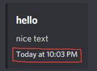

# $addTimestamp

### Usage

```php
$addTimestamp[milliseconds (optional)]
```

This function has one field.

1. `milliseconds` - The timestamp to display in milliseconds, uses the current time of the user's locale if no arguments are provided. \| Optional

## Usage

```javascript
bot.command({
name: "timestamp"
code: `
$title[hello]
$description[nice text]
$addTimestamp
`
}) //Check below for the bots response
```



Tip: Did you know, if a message with `$addTimestamp` was sent at a previous date, it will return:


```javascript
bot.command({
name: "timestamp"
code: `
$title[hello]
$description[nice text]
$addTimestamp[453465654]
`
}) //This one has milliseconds added to it!
```


