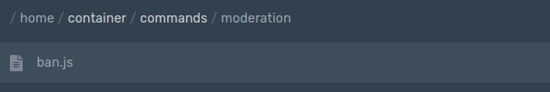

# Command Handler

### **Main File Adjustments**

Simply add this to your main file:

```javascript
bot.loadCommands(`./commands/`)
```

For example:

```javascript
const Aoijs = require("aoi.js")

const bot = new Aoijs.Bot({
  token: "TOKEN",
  prefix: ["PREFIX"],
})

bot.onMessage()
bot.loadCommands(`./commands/`) //Allows commands executed in the commands folder.
```

### Command Handler Setup

**\#1:** Create a folder named "commands".


**\#2:** Make a subfolder \(optional\).


**\#3:** Finally, make your file. The file name should be in the format of `fileName.js`.



### Command Handler Format

Make your commands in command handler like this:

```javascript
module.exports = {
      name: "name",
      code: `your code/message`
}
```

### Different Command Types in Command Handler

`bot.commandType` isn't needed in command handler. Simply use `type: 'commandType'`.

```javascript
module.exports = {
      type: 'joinCommand',
      channel: "$systemChannelID",
      code: `your code/message`
}
// You still have to add the event in your main file.
```

### Multiple Commands in One File

If you want to use multiple commands inside one command handler file, make your file look like this:

```javascript
module.exports = [{
  type: 'joinCommand',
  channel: '773364744240496640',
  code: `Welcome $userTag !!`
}, {
  name: 'ping',
  code: `Pong! $pingms`
}]
```

